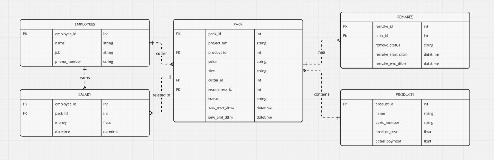

# Sewing Workshop - Telegram Bot for Production Tracking

**Technologies**:
- 🐍 Python 3.10+
- 🗄️ SQLite + Google Sheets integration
- ⚡ Quart + Hypercorn (async server)
- 🛡️ Nginx (reverse proxy)
- 🧩 Aiogram 3.x (Telegram API)

**Project Structure**:\
project/\
├── app/\
│ ├── handlers/ # Message handlers\
│ ├── keyboards/ # Keyboard generators\
│ ├── services/ # Business logic & integrations\
│ ├── database/ # Database operations\
│ └── states/ # Finite State Machines\
├── documents/ # Schemas & documentation\
├── credentials.py # Access keys\
├── schema.sql # DB initialization\
└── requirements.txt # Dependencies\

**Key Features**:
1. 🧵 Batch tracking (start/complete)
2. 🔧 Equipment repair requests
3. 📊 Automated Google Sheets reporting
4. 📷 QR code recognition for product labels
5. 👥 Role-based access system (seamstresses, controllers, managers)

**Implementation Highlights**:
- Async database operations (aiosqlite)
- FSM for multi-step dialogues
- Custom role-based keyboards
- Input validation
- Comprehensive logging

**Installation**:

database:

